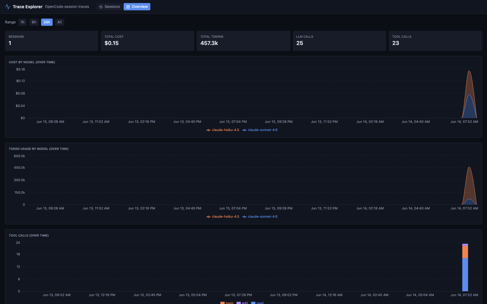
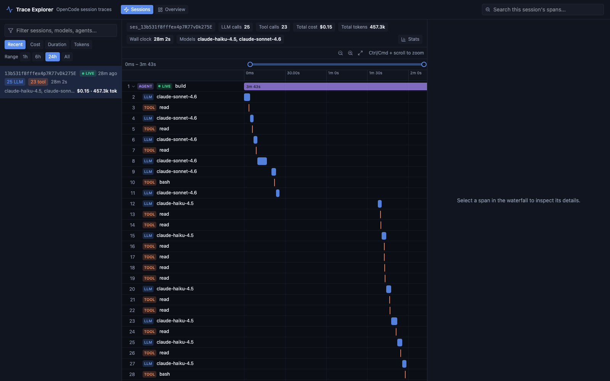

# OpenCode Observability Stack

[](LICENSE)
[](docker-compose.yml)
[](https://schemaitat.github.io/opencode-otel-observability/)

A self-contained observability stack for [OpenCode](https://opencode.ai), built on the
[`opencode-plugin-otel`](https://github.com/schemaitat/opencode-plugin-otel)
plugin. Ships a Grafana dashboard with cost/token analytics, TraceQL-based explainability, and
a standalone session timeline (waterfall) explorer.

## Screenshots

| Grafana dashboard | Trace Explorer — Overview |
|---|---|
|  |  |

| Trace Explorer — Sessions |
|---|
|  |

## Prerequisites

- [Docker](https://docs.docker.com/get-docker/) with Compose v2 (`docker compose`)
- [`just`](https://github.com/casey/just) _(optional — wraps common commands)_
- [Bun](https://bun.sh) _(only if building the plugin from source — see below)_

## Quick Start

### 1. Start the observability stack

```bash
docker compose up -d
# or: just up
```

### 2. Install and configure the plugin

**Option A — npm (recommended, no build step):**

Add the plugin to `~/.config/opencode/opencode.json` (merge into your existing config):

```json
{
  "$schema": "https://opencode.ai/config.json",
  "plugin": ["@devtheops/opencode-plugin-otel"]
}
```

OpenCode installs it automatically at startup from the npm registry. The published package includes pre-built output — no Bun required.

**Option B — local `file:` path (for development/customization):**

Clone and build the plugin manually first — OpenCode does not build it for you:

```bash
git clone https://github.com/DEVtheOPS/opencode-plugin-otel ~/projects/opencode-plugin-otel
cd ~/projects/opencode-plugin-otel
bun install
bun run build
```

Then reference it by absolute path:

```json
{
  "$schema": "https://opencode.ai/config.json",
  "plugin": ["@devtheops/opencode-plugin-otel@file:/home/you/projects/opencode-plugin-otel"]
}
```

> **Note:** `~` is not valid here — use the full absolute path. OpenCode symlinks the directory into its cache; if `dist/` is missing or stale the plugin loads silently but does nothing. Re-run `bun run build` after any source change.

> **Git URLs** (e.g. `github:DEVtheOPS/opencode-plugin-otel`) do not work — the `prepare` script is absent so the build never runs and `dist/` is never produced.

### 3. Enable telemetry

Export environment variables before running `opencode`:

```bash
export OPENCODE_ENABLE_TELEMETRY=1
export OPENCODE_OTLP_ENDPOINT=http://localhost:4317
export OPENCODE_OTLP_PROTOCOL=grpc
```

Or add these to your shell profile (`.bashrc`, `.zshrc`, etc.).

### 4. Access the dashboards

Dashboards will be empty until you run OpenCode (step 5).

| URL | Service |
|-----|---------|
| http://localhost:3000 | Grafana — "OpenCode Observability" (admin/admin) |
| http://localhost:8060 | Trace Explorer |
| http://localhost:9090 | Prometheus |
| http://localhost:3200 | Tempo |
| http://localhost:4317 | OTLP collector — gRPC ingest (used by the plugin) |
| http://localhost:3100 | Loki |

### 5. Run OpenCode

Now when you run `opencode`, traces and metrics will be emitted to the local OTLP collector and visible in the dashboards above.

See the [Quick Start guide](https://schemaitat.github.io/opencode-otel-observability/quick-start/)
for the full walkthrough.

## Uninstall

**Stop the stack:**

```bash
docker compose down
# or: just down
```

**Remove the plugin and its config:**

```bash
rm -rf ~/projects/opencode-plugin-otel
```

Remove the plugin entry from `~/.config/opencode/opencode.json`:

```json
{
  "plugin": ["file:///home/you/projects/opencode-plugin-otel"]
}
```

Delete that line (or the entire `"plugin"` key if it's the only entry).

Also remove the telemetry env vars from your shell profile if you added them.

## Features

- **Cost & token analytics** — usage by model, agent, and session; breakdown by token type
- **Tool usage** — call counts, average duration, and success rate per tool
- **Productivity** — lines added/removed, message counts per session
- **TraceQL tables** — LLM calls (prompt → model → outcome) and tool calls (tool → params → result)
- **Trace → Logs linking** — click a span in Grafana to jump to matching Loki logs
- **Trace Explorer** — React/FastAPI waterfall SPA with session timelines, subagent linking, and a
  cross-session usage dashboard
- **Dashboard filters** — `session_id`, `model`, and `agent` template variables apply to every panel

## Documentation

Full documentation is published at
**[schemaitat.github.io/opencode-otel-observability](https://schemaitat.github.io/opencode-otel-observability/)**,
or browse it directly in [`docs/`](docs/):

- [Architecture](docs/architecture.md) — how the services fit together
- [Quick Start](docs/quick-start.md) — start the stack and connect OpenCode
- [Metrics, Logs & Traces](docs/telemetry.md) — what's exported and how to query it
- [Dashboard](docs/dashboard.md) — the Grafana "OpenCode Observability" dashboard
- [Trace Explorer](docs/trace-explorer.md) — the standalone waterfall + usage dashboard UI
- [Configuration](docs/configuration.md) — collector, Tempo, and Grafana datasource details
- [Development](docs/development.md) — `just` targets and local dev workflow

## License

[MIT](LICENSE)
