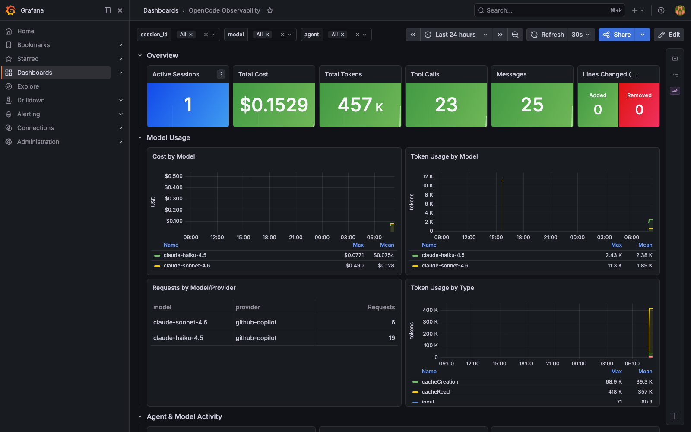

# Dashboard

The "OpenCode Observability" dashboard
([`opencode-dashboard.json`](https://github.com/aschemaitat/opencode-otel-observability/blob/main/opencode-dashboard.json))
is filterable by `$session_id`, `$model`, and `$agent`:

- **Overview** — active sessions, total cost, total tokens, tool calls, messages, lines changed
- **Model Usage** — cost/token/request breakdowns by model and provider
- **Agent & Model Activity** — cost/token/request breakdowns by agent
- **Tool Usage** — call counts, avg duration, success rate
- **Explainability: Calls & Reasoning** — LLM calls table and tool calls table via Tempo TraceQL `select()`
- **Traces & Drill-down** — recent trace list with drill-down and linked Loki logs
- **Event Logs** — API requests, tool results, session lifecycle (Loki)

